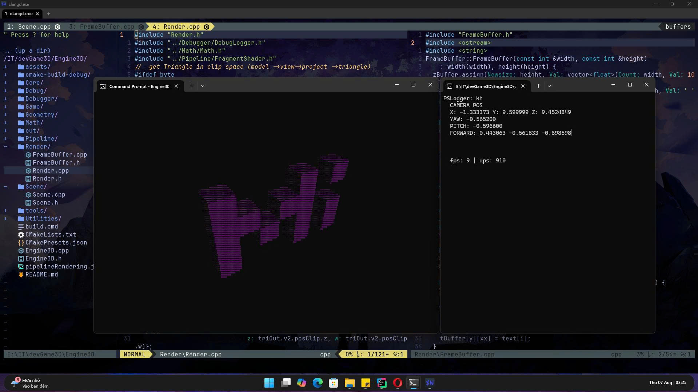
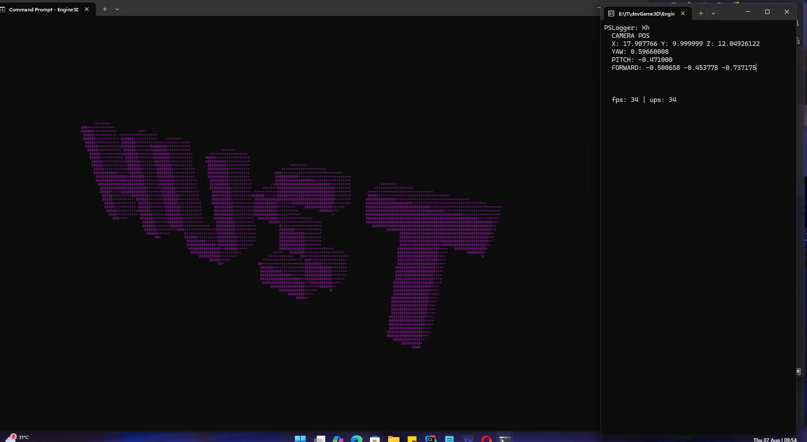

# 🧠 EngineGame3D - Terminal 3D Software Renderer

  

**EngineGame3D** là một engine dựng hình 3D được viết hoàn toàn bằng C++ thuần, không sử dụng bất kỳ thư viện ngoài nào (như OpenGL, SDL, glm...). Mục tiêu của dự án là xây dựng lại toàn bộ pipeline đồ họa 3D hiện đại – từ `vertex shader`, `assembly`, `clipping`, `culling`, đến `rasterization` – và hiển thị kết quả bằng ký tự ASCII ngay trên **terminal**.

## 🎯 Mục tiêu chính

- ✅ Dựng hình Cube, Triangle, Model từ Mesh cơ bản.
- ✅ Ánh xạ không gian mô hình → thế giới → camera → clip → NDC → viewport.
- ✅ Cắt tam giác (clipping) với 6 mặt frustum.
- ✅ Culling backface.
- ✅ Vẽ đường viền tam giác bằng ký tự trên terminal.
- ✅ Điều khiển camera/model bằng bàn phím (wasd/z/c).

## 📸 Demo

  
<sup><sub>*Chữ Mi xây bang các khối vuông trong không gian*</sub></sup>

  
<sup><sub>*Chữ HUST xây bằng các khôi vuông trong không gian*</sub></sup>

## 🏗️ Kiến trúc hệ thống

```plaintext
          ┌────────┐
          │ Scene  │
          └────┬───┘
               ▼
        ┌────────────┐
        │   Model    │────────┐
        └────┬───────┘        │
             ▼                ▼
        ┌────────┐      ┌────────┐
        │ Mesh   │─────▶│ Buffer │
        └────────┘      └────────┘
                               │
              ┌────────────────────────────────────┐
              ▼                                    ▼
        Vertex Shader ──▶ Clipping & Culling ──▶ Assembly ──▶ Rasterization
                         (Frustum 6-plane)       (to triangle)   │
                                                                  ▼
                                                         ASCII Rendering
```

## ⚙️ Các bước Pipeline

1. **Vertex Shader**  
   Ma trận `Model * View * Projection` biến đổi đỉnh về clip-space (`Vec4`).

2. **Clipping**  
   - Cắt tam giác với 6 mặt phẳng: left, right, top, bottom, near, far.
   - Giải thuật Sutherland–Hodgman mở rộng.

3. **Backface Culling**  
   - Dựa vào hướng pháp tuyến và chiều winding để loại tam giác không nhìn thấy.

4. **Primitive Assembly**  
   - Ghép các chỉ số từ `IndexBuffer` thành `Triangle`.

5. **NDC → Viewport Mapping**  
   - Chuẩn hóa về `[-1, 1]`, sau đó ánh xạ sang tọa độ terminal.

6. **Rasterization**  
   - Vẽ cạnh tam giác bằng thuật toán `line interpolation` đơn giản (Bresenham-like).

## 🎮 Điều khiển

| Phím | Hành động             |
|------|------------------------|
| `W/S` | Di chuyển model lên/xuống |
| `A/D` | Di chuyển model trái/phải |
| `Z/C` | Di chuyển model trước/sau |

## 🧱 Cấu trúc thư mục

```
EngineGame3D/
├── Core/
│   ├── Buffer.{h,cpp}
│   └── Camera.{h,cpp}
├── Geometry/
│   ├── Mesh.{h,cpp}
│   ├── Model.{h,cpp}
│   └── Vertex.h
├── Pipeline/
│   ├── Pipeline.{h,cpp}
│   └── Culling.{h,cpp}
├── Render/
│   └── Render.{h,cpp}
├── Scene/
│   └── Scene.{h,cpp}
├── Math/
│   └── Math.{h,cpp}
├── Engine3D.cpp
├── CMakeLists.txt
└── ...
```

## 🔧 Build

### Yêu cầu:
- **CMake ≥ 3.8**
- **Compiler hỗ trợ C++20 (MSVC/GCC/Clang)**

### Cách build (Windows + MSVC):

```bash
cmake -S . -B build
cmake --build build
```

### Hoặc với preset (nếu có thiết lập `CMakePresets.json`):

```bash
cmake --preset x64-debug
cmake --build out/build/x64-debug
```

## 🚀 Chạy

Sau khi build, chạy file `Engine3D.exe`. Terminal sẽ hiện một khung với mô hình Cube được vẽ bằng ký tự `#`. Bạn có thể di chuyển Cube bằng các phím điều khiển.

## 📚 Kiến thức liên quan

- 🎓 Đại số tuyến tính: không gian vector, ma trận, phép chiếu.
- 🧠 Kiến trúc pipeline đồ họa: tương tự OpenGL fixed pipeline.
- 💡 Clip space → NDC → viewport transform.
- 🧮 Backface culling: tích có hướng trong NDC.

## 🔮 Kế hoạch tương lai

- [ ] Thêm shading mô phỏng (flat shading).
- [ ] Hiển thị buffer z (depth buffer).
- [ ] Đổ màu tam giác bằng ký tự (fill triangle).
- [ ] Hỗ trợ nhiều mô hình và chuyển động camera.

## 📜 Giấy phép

MIT License.

---

> Dự án được viết ra với đam mê về đồ họa máy tính, học thuật và tinh thần *"học từ gốc"*. Mọi thứ từ ma trận phép chiếu, dựng hình, culling, clipping... đều được code tay ✨
